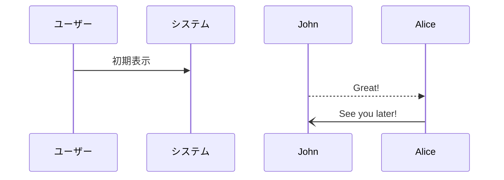

# stamp_rally_worship

## アプリの特徴
- DBはなし
- superbaseを採用
※ 料金 & RDSのため
- 課金処理は、edge function or revenuecatを採用予定予定 (値段的にはrevenuecatかな。。？)

## アーキテクチャー
Page → Usecase → Repository (+ entity)の3構成の基本3構成

※ 場合によってはController層を採用するかも？

### Page
- Widgetでのページの表現

### Usecase (state管理の箇所)
- ドメインロジックの表現
- データ加工など (バックエンドがないため)
- riverpodで管理するため、単一責任で実装する。
- オブジェクト単位でデータを管理する。
※ 依存性の管理には注意をする。

#### Riverpod
基本的に、参照系と更新系で命名を分ける。
CQRSを参考にし、単方向データフローを実現するため。

参照系は基本FutureProviderを使用する。
参照系の命名例: FetchXXUseCase 
※ 参照系であることがわかるようにする。

更新系は、NotifierProvider or AsyncNotifierProviderを使用する。
更新系の命名例: CommandXXUseCase

### Repository
- 外部との連携を表現する箇所
- riverpodでDIを行う。
- データ管理などは行わないため、autoDispose: falseにする。

### Entity
- Repository、Usecaseから取得したデータを管理する。
- Entityにまつわるロジックなどは、できるだけEntityに集約させる。
- インスタンス生成は、ファクトリーメソッドを経由させて生成させる。

### 単体テスト
- 基本usecase層に対して単体テストを行う。

## supebase の料金

- API リクエストに制限はなし
- 1 ヶ月に 50,000 ユーザーアクティブ可能
- 500MB データ量格納可能
- 1G ファイル格納可能

## アプリの内容

このアプリは会員登録をし、
現地に行き QR コードか GPS のみでこの「参拝カード」を取得します。
それには「神社名」「神社住所」「通し番号」「取得年月日」を自動入力します。
おみくじ的な「コメント」もランダムで入力します。
背景画像も適時（月ごと・週ごと）変更します。
出来たら 100 円くらいの課金後取得も考えています。

参考
https://peppermint-sunset-fc2.notion.site/Never-0ee09657e5744cc8bb3c99cf9cdb2cff
https://github.com/hukusuke1007/flutter_app_template/blob/main/feature_first/lib/features/timeline/use_cases/fetch_poster.dart

## システム関連図

